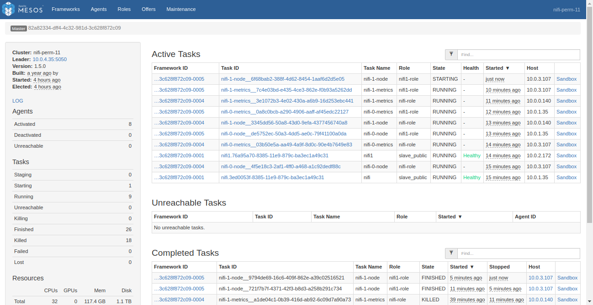
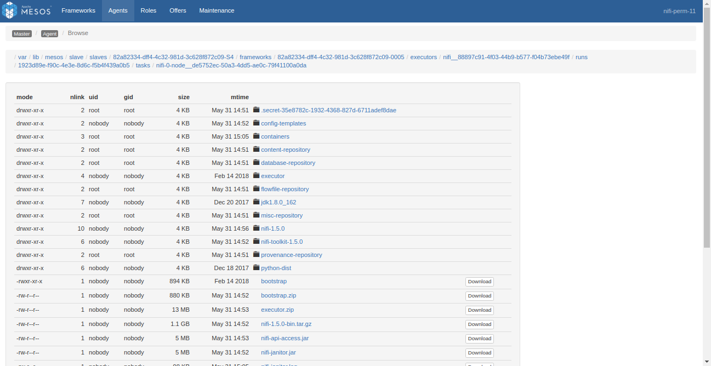
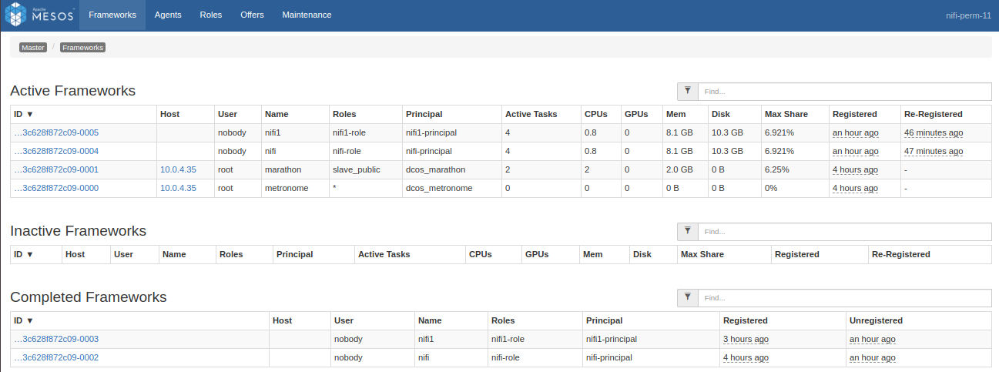
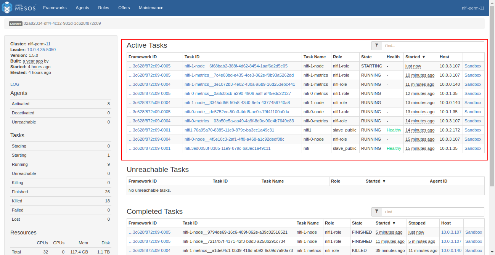
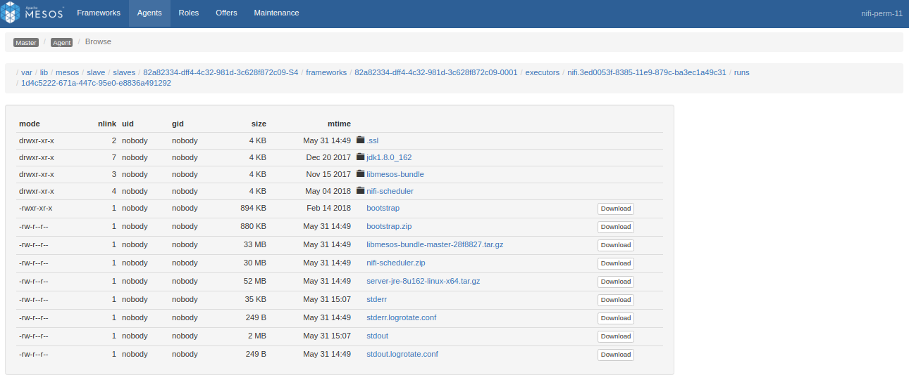
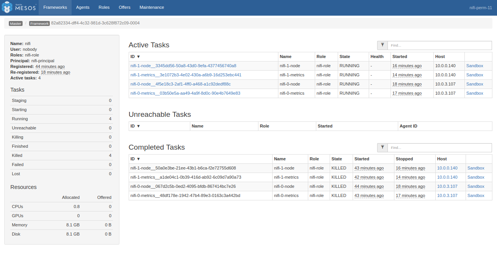
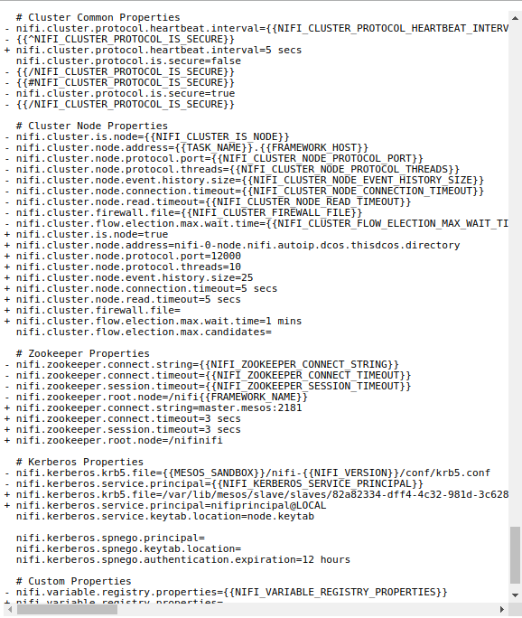
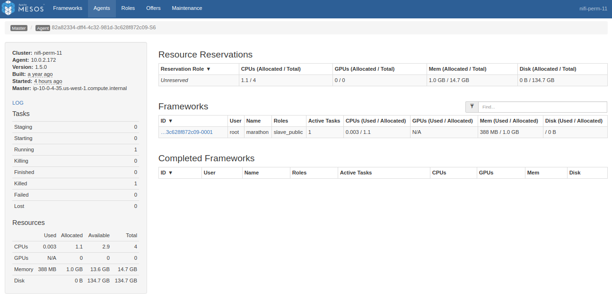
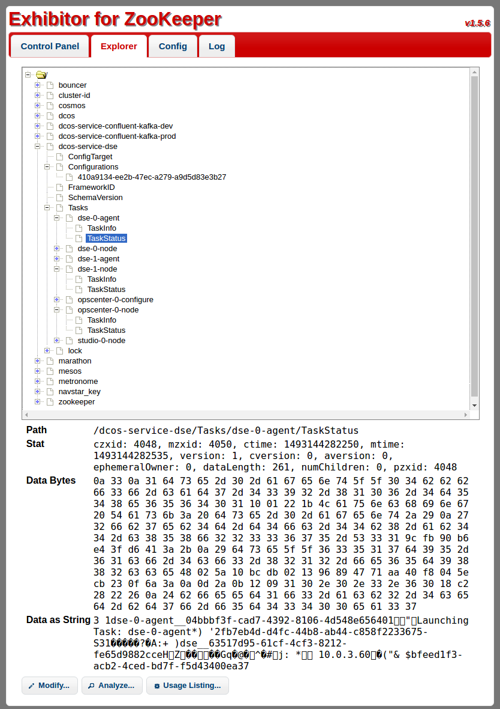

# Diagnostic Tools

DC/OS clusters provide several tools for diagnosing problems with services running in the cluster. In addition, the SDK has its own endpoints that describe what the Scheduler is doing at any given time.

## Logging

The first step to diagnosing a problem is typically to take a look at the logs. Knowledge of the problem being diagnosed will help you to determine which task logs are relevant.

The best and fastest way to view and download logs is via the Mesos UI at `<dcos-url>/mesos`. On the Mesos front page you will see two lists: A list of currently running tasks, followed by a list of completed tasks (whether successful or failed).

Figure 1. - Mesos front page

The Sandbox link for one of these tasks shows a list of files from within the task itself. For example, here’s a sandbox view of a nifi-0-node task from the above list:

Figure 2. - Task file list

If the task is based on a Docker image, this list will only show the contents of `/mnt/sandbox`, and not the rest of the filesystem. If you need to view filesystem contents outside of this directory, you will need to use `dcos task exec` or `nsenter` as described below under [Running commands within containers](#running-commands-within-containers).

In the task list in Figure 1, multiple services are installed, resulting in a large list. The list can be filtered using the text box at the upper right, but there may be duplicate names across services. For example there are two instances of {{ model.serviceName }} and they’re each running a node-0. As the cluster grows, this confusion gets proportionally worse. We want to limit the task list to only the tasks that are relevant to the service being diagnosed. To do this, click “Frameworks” on the upper left to see a list of all the installed frameworks (mapping to our services):

Figure 3. - Active Frameworks

We then need to decide which framework to select from this list. This depends on what task we want to view.

## Scheduler Logs

If the issue is one of deployment or management, for example, a service is ‘stuck’ in initial deployment, or a task that previously went down is not being brought back at all, then the Scheduler logs will likely be the place to find out why.

From Mesos’s perspective, the Scheduler is being run as a Marathon app. Therefore we should pick marathon from this list and then find our Scheduler in the list of tasks.

Figure 4. - List of active tasks

Scheduler logs can be found either via the main Mesos frontpage in small clusters (possibly using the filter box at the top right), or by navigating into the list of tasks registered against the marathon framework in large clusters. In SDK services, the Scheduler is typically given the same name as the service. For example a `nifi-dev` service’s Scheduler would be named `nifi-dev`. Use the Sandbox link to view the Sandbox portion of the Scheduler filesystem, which contains files named `stdout` and `stderr`. These files respectively receive the `stdout/stderr` output of the Scheduler process, and can be examined to see what the Scheduler is doing.

Figure 5. - Scheduler output

## Task Logs

When the issue being diagnosed has to do with the service tasks, e.g. a given task is crash looping, the task logs will likely provide more information. The tasks being run as a part of a service are registered against a framework matching the service name. Therefore, we should pick `<service-name>` from this list to view a list of tasks specific to that service.

Figure 6. - Tasks running in a framework

In the list above, we see separate lists of Active and Completed tasks:

- Active tasks are still running. These give a picture of the current activity of the service.
- Completed tasks have exited for some reason, whether successfully or due to a failure. These give a picture of recent activity of the service.

<strong>NOTE: </strong>Older completed tasks will be automatically deleted and their data may no longer be available here.

Either or both of these lists may be useful depending on the context. Use the Sandbox link for one of these tasks and then start looking at Sandbox content. Files named `stderr` and `stdout` hold logs produced both by the SDK Executor process (a small wrapper around the service task) as well as any logs produced by the task itself. These files are automatically paginated at 2MB increments, so older logs may also be examined until they are automatically pruned.

Figure 7. - Output of `stderr` log file

## Mesos Agent logs

Occasionally, it can also be useful to examine what a given Mesos agent is doing. The Mesos Agent handles deployment of Mesos tasks to a given physical system in the cluster. One Mesos Agent runs on each system. These logs can be useful for determining if there’s a problem at the system level that is causing alerts across multiple services on that system.

Navigate to the agent you want to view either directly from a task by clicking the “Agent” item in the breadcrumb when viewing a task (this will go directly to the agent hosting the task), or by navigating through the “Agents” menu item at the top of the screen (you will need to select the desired agent from the list).

In the Agent view, you will see a list of frameworks with a presence on that Agent. In the left pane you will see a plain link named **LOG**. Click that link to view the agent logs.

Figure 8. - Mesos Agent log

## Logs via the CLI

You can also access logs via the DC/OS CLI using the `dcos task log` command. For example, assume the following list of tasks in a cluster:

Figure 9. - Output of command `dcos task log`

## Running commands within containers

An extremely useful tool for diagnosing task state is the ability to run arbitrary commands within the task. The available tools for doing this is as follows:

DC/OS 1.9 introduced the task exec command, which can be used to run.

### Prerequisites

- SSH keys for accessing your cluster configured, for example, via `ssh-add`. SSH is used behind the scenes to get into the cluster.
- A recent version of the [DC/OS CLI](https://docs.mesosphere.com/1.11/cli/) with support for the `task exec` command.

### Using `dcos task exec`    

Once you are set up, running commands is very straightforward. For example, let’s assume the list of tasks from the CLI logs section above, where there’s two broker-0 tasks, one named broker-0__81f56cc1-7b3d-4003-8c21-a9cd45ea6a21 and another named broker-0__75bcf7fd-7831-4f70-9cb8-9cb6693f4237. Unlike with task logs, we can only run `dcos task exec` on one command at a time, so if two tasks match the task filter then we see the following error:

Figure 10. - Multiple tasks error message

Therefore we need to be more specific:

Figure 11. - Output of command `dcos task specific`

We can also run interactive commands using the -it flags (short for --interactive --tty):

Figure 12. - Interactive commands

While you could technically change the container filesystem using `dcos task exec`, any changes will be destroyed if the container restarts.

## Querying the Scheduler

The Scheduler exposes several HTTP endpoints that provide information on any current deployment as well as the Scheduler’s view of its tasks. For a full listing of HTTP endpoints, see the [API reference](https://mesosphere.github.io/dcos-commons/reference/swagger-api/). The Scheduler endpoints most useful to field diagnosis come from three sections:

- Plan: Describes any work that the Scheduler is currently doing, and what work it’s about to do. These endpoints also allow manually triggering Plan operations, or restarting them if they’re stuck.
- Pods: Describes the tasks that the Scheduler has currently deployed. The full task info describing the task environment can be retrieved, as well as the last task status received from Mesos.
 - State: Access to other miscellaneous state information such as service-specific properties data.

For full documentation of each command, see the see the [API Reference](../../api-reference). Here is an example of invoking one of these commands against a service named hello-world via curl:

Figure 13. - Output of `hello-world`

## ZooKeeper/Exhibitor

<strong>WARNING: </strong>This option should only be used as a last resort. Modifying anything in ZooKeeper directly may cause your service to behave in unpredictable ways.

DC/OS comes with Exhibitor, a commonly used frontend for viewing ZooKeeper. Exhibitor may be accessed at dcos-url/exhibitor. A given SDK service will have a node named dcos-service-<svcname> visible here. This is where the Scheduler puts its state, so that it isn’t lost if the Scheduler is restarted. In practice it is far easier to access this information via the Scheduler API (or via the service CLI) as described earlier, but direct access using Exhibitor can be useful in situations where the Scheduler itself is unavailable or otherwise unable to serve requests.

Figure 14. - Exhibitor for ZooKeeper directory
